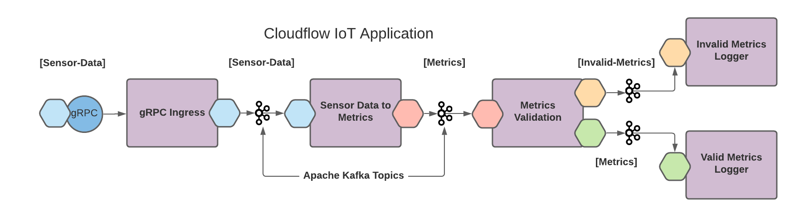
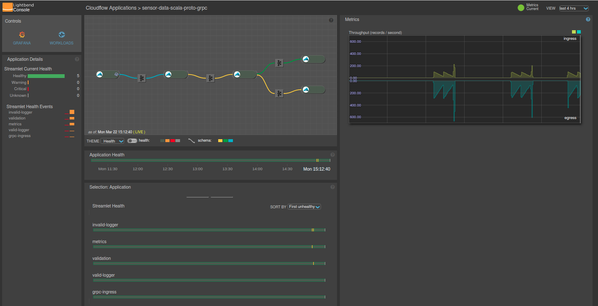

# Akka Data Pipelines (Java) - Streaming Data Pipelines Simplified - Introduction

Note: This is a Java version of the of the previously published Scala version of the guide described below. This is a work in progress, which also provides a Maven version for building and deploying the sample pipeline. 

## Streaming Data Is More Interesting Than Data At Rest

Building streaming pipelines to move data from one source to another—so it can be stored, used for analytics, or combined with other data—can get to be quite complicated. We've made developing streaming applications a lot simpler with Akka Data Pipelines, so that you can be more productive when you're use cases include the following examples:

- Internet of Things (IoT) applications to collect metrics from sensors or devices
- Digital twins of devices to monitor power equipment or connected cars
- Data pipelines that stream to a machine learning algorithm

To help get you started, we have a new [Akka Data Pipelines IoT Sensor Tutorial](https://developer.lightbend.com/guides/akka-data-pipelines-iot-sensor-tutorial/) to bring you with a hands-on coding experience.

> In case you missed it, [Akka Data Pipelines](https://www.lightbend.com/akka-data-pipelines) is the enterprise packaging of Lightbend's OSS Cloudflow project, which provides Lightbend Telemetry for insights into your running system as well as world-class support and guidance from the Lightbend engineering teams.



By leveraging [Akka Data Pipelines from Lightbend](https://www.lightbend.com/akka-data-pipelines), you can accelerate development and decrease risks. To illustrate how we can help you build streaming systems faster and easier, this [Akka Data Pipelines IoT Sensor Tutorial](https://developer.lightbend.com/guides/akka-data-pipelines-iot-sensor-tutorial/) covers the following topics and domains:

- What is Akka Data Pipelines, and why you should care
- Setting up a local Kubernetes test environment using MicroK8s
- Installing Akka Data Pipelines
- Testing and running a sample application that tracks IoT sensor data for working windmills
- Monitoring the IoT PoC with Lightbend Telemetry and Console
- Finally, we walk you through the code base of the sample application

You can find the Akka Data Pipelines Tutorial [here](https://developer.lightbend.com/guides/akka-data-pipelines-iot-sensor-tutorial/).


---
# Update Notes
July 1, 2021 
- Upgrade Kafka to 2.8.0 with Strimzi
June 30, 2021 
- Releasing Java version to the public.
- Maven can be used here instead of SBT. For more infomation on using Maven with Cloudflow please see [this](https://cloudflow.io/docs/current/develop/maven-support.html).
---
# Other Notes:

## grpcurl
https://github.com/fullstorydev/grpcurl

## Listing Services
grpcurl -plaintext localhost:3000 list

SensorDataService
grpc.reflection.v1alpha.ServerReflection

## Describing Elements
grpcurl -plaintext localhost:3000 describe SensorDataService

```
SensorDataService is a service:
service SensorDataService {
    rpc Provide ( .SensorData ) returns ( .SensorDataReply );
    rpc ProvideStreamed ( stream .SensorData ) returns ( stream .SensorDataReply );
}
```

## Invoking Service

### runLocal

grpcurl -plaintext -d '{"deviceId":"c75cb448-df0e-4692-8e06-0321b7703992","timestamp":1495545646279,"measurements":{"power":1.7,"rotorSpeed":3.9,"windSpeed":105.9}}' \
localhost:3000 SensorDataService/Provide
```
{
"deviceId": "c75cb448-df0e-4692-8e06-0321b7703992",
"success": true
}
```

### Invoking through Traefik Ingress on Microk8s (localhost:8080)
grpcurl -plaintext -d '{"deviceId":"c75cb448-df0e-4692-8e06-0321b7703992","timestamp":1495545646279,"measurements":{"power":1.7,"rotorSpeed":3.9,"windSpeed":105.9}}' \
localhost:8080 SensorDataService/Provide

## invalid

### runLocal
grpcurl -plaintext -d '{"deviceId":"dev1","timestamp":1495545646279,"measurements":
{"power":-1.7,"rotorSpeed":3.9,"windSpeed":105.9}}' \
localhost:3000 SensorDataService/Provide

### Invoking through Traefik Ingress on Microk8s (localhost:8080)
grpcurl -plaintext -d '{"deviceId":"c75cb448-df0e-4692-8e06-0321b7703992","timestamp":1495545646279,"measurements":{"power":1.7,"rotorSpeed":-3.9,"windSpeed":105.9}}' \
localhost:8080 SensorDataService/Provide


# Maven Builds

equivalent of `sbt:runLocal`
        
```
mvn clean package cloudflow:extract-streamlets cloudflow:verify-blueprint cloudflow:app-layout cloudflow:run-local
```

equivalent of `sbt:buildApp`

```
mvn clean
mvn \
  package \
  cloudflow:extract-streamlets \
  docker:build \
  cloudflow:push-images \
  -Ddocker.username=${DOCKER_USERNAME} \
  -Ddocker.password=${DOCKER_PASSWORD} \
  -DskipTests
mvn cloudflow:build-app
```